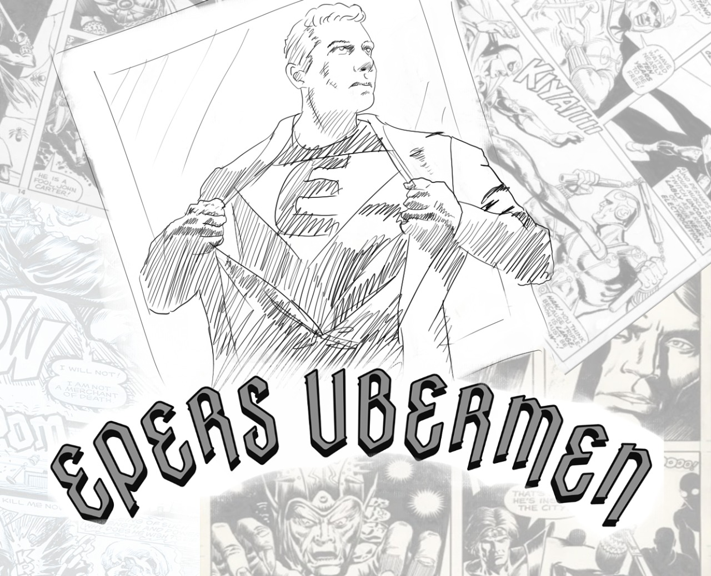

La ciudad llora. Las calles que ayer tan familiares y seguras nos parecian hoy son como un despiadado extraño, y en los callejones más allá de la vista pero sutilmente detectable por la intuición, se oculta la maldad y el crimen.

Pero solo en las más terribles tinieblas puede brillar con su mayor intensidad la luz.

En el momento mas lugubre de nuestra historia fue cuando entonces aparecieron los Heroes! Seres super humanos capaces de proezas de características supra-naturales.

Algunos de ellos pueden volar, otros lanzar rayos por sus ojos, y algunos también pueden hasta levantar un camión sobre sus cabezas.

Desde su aparición, el mundo se encuentra sumergido en un diálogo constante entre el bien y el mal, una dicotomía de héroes y villanos que se disputan las calles, la riqueza y el poder sociopolítico.

Y en medio de estos colosos te encontras vos, un simple desarrollador de software con el único poder de llegar a duras penas a fin de mes.

Buscando mejorar tu situación económica, das con una oportunidad laboral que promete no solo mejorar tu precario estilo de vida, sino también ayudar a toda la sociedad en conjunto.

El nombre del nuevo proyecto en el cual vas a empezar a trabajar se llamará:

  

Nos asignaron al equipo de backend, encargado de implementar la lógica de negocio que correrá (por ahora) en un datacenter de la empresa. La aplicación también cuenta con un frontend web el cual interactuará con nuestro backend por medio de una capa de servicios.

## Entregas
- [Entrega 1 - JDBC](enunciado/entrega1/entrega1.md)
- [Entrega 2 - ORM - Hibernate](enunciado/entrega2/entrega2.md)
- [Entrega 3 - ORM - Spring](enunciado/entrega3/entrega3.md)
- [Entrega 4 - No-SQL - Neo4J](enunciado/entrega4/entrega4.md)
- [Entrega 5 - No-SQL - MongoDB](enunciado/entrega5/entrega5.md)
