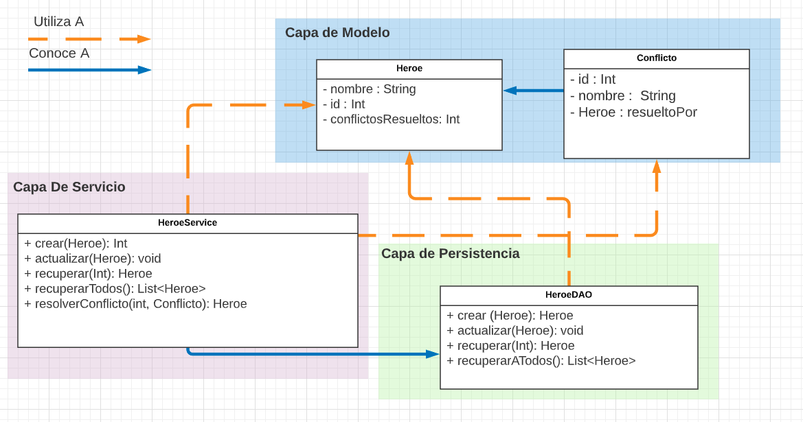

## Entrega 1 - JDBC

No mucho tiempo pasa desde que empezaste a trabajar en esta nueva empresa, que el CEO reúne a toda la fuerza de trabajo y comparte el conocimiento necesario para comenzar con la implementación de la aplicación.

Nos cuenta que nos interesa llevar cuenta de las proezas realizadas por los héroes para poder determinar cual es el mejor superhéroe en cada país, o tal vez en el mundo.

Para poder llevar cuenta de las actividades de los superheroes, los civiles (usuarios como vos y yo) podrán dar aviso de amenazas, crimenes y desafíos a través de la aplicación.
Los heroes por otra parte, tendrán una cuenta especial en la cual durante sus patrullas, recibirian estas notificaciones provenientes de los civiles y podrán elegir enfrentar el conflicto a cambio de una módica recompensa, o ignorarlo si creen que supera sus habilidades.

Tendremos un sistema que llevará cuenta del enfrentamiento a estos encuentros, y registrará el desempeño del héroe en base a diversos factores como tiempo, eficacia, satisfaccion del civil, y si el héroe superó el desafío o lo fracasó completamente.

(En pocas palabras, tendremos que implementar un Uber de superheroes)

  

Como primer prueba de concepto, nos encarga dar los primeros pasos haciendo realidad esta parte inicial del proyecto.

Se nos pide tener un módulo que nos permita administrar los diferentes tipos de héroes y donde puedan registrarse los conflictos que esos héroes resuelven. Luego de horas de discusión y planeamiento, el líder técnico llega a nosotros con la siguiente interfaz:

  

***Clase: Heroe:***

Propiedades: 
- id: int
- nombre: String
- conflictosResueltos: int

***Clase: Conflicto:***

Propiedades: 
- id: Int
- nombre: String
- Heroe: resueltoPor

La interfaz `HeroeDAO` declara los siguientes métodos que nosotros debemos implementar:

- `crear(heroe: Heroe ): Int` - Recibe un objeto `Heroe` y se encarga de persistirlo en la base de datos. Devuelve el Id del heroe.

- `actualizar(heroe: Heroe)` - Actualiza al Heroe recibido por parámetro.

- `recuperar(idDelHeroe: Int): Heroe` - Este método devolverá al heroe cuyo Id sea igual al provisto por parámetro. Se espera que este método devuelva, a lo sumo, un solo resultado.

- `recuperarTodos(): List<Heroe>` - Este método deberá devolver una lista de todos los heroes existentes ordenados alfabéticamente por su nombre en forma ascendente.

El equipo de front estará utilizando la interfaz  `HeroeService` para comunicarse con nuestro equipo. Este servicio deberá implementar métodos que utilizaran al DAO, sumado al siguiente método:

- `resolverConflicto(idDelHeroe: Int, conflicto: Conflicto) : Heroe` - Deberá lograr que el heroe cuente el conflicto como resuelto. Por el momento no nos interesa persistir este conflicto, pero si llevar la cuenta de la cantidad de conflictos resueltos que tiene nuestro heroe.

### Se pide:
- Que provean implementaciones para las interfaces descriptas anteriormente, haciendo uso de todo lo visto en clase.
- Asignen propiamente las responsabilidades a todos los objetos intervinientes, discriminando entre servicios, DAOs y objetos de negocio.
- Creen test unitarios para cada unidad de código entregada que prueben todas las funcionalidades pedidas, con casos favorables y desfavorables. Si quieren van a poder probar la aplicación utilizando la UI provista, pero **deben** hacer test unitarios de cualquier forma.
- Provean un archivo .sql con las sentencias DDL que sean necesarias para crear el schema de la base de datos (create tables).

### Recuerden que:
- No pueden modificar la interfaz dada de `HeroeService` y `HeroeDAO`, pero si agregarle nuevos metodos si lo ven necesario.
- Pueden agregar nuevos métodos y atributos a los objetos `Heroe` y `Conflicto`, pero no eliminar o renombrar atributos / métodos ya provistos.
