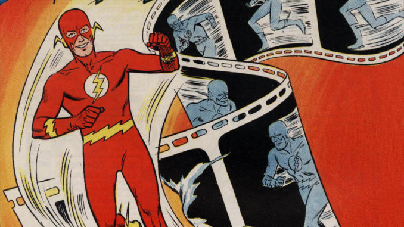
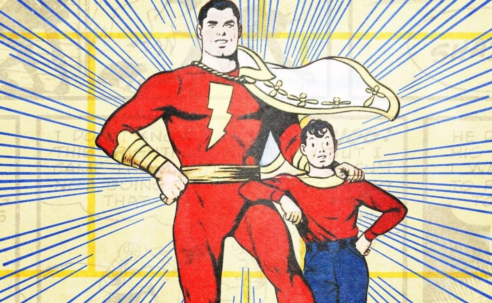

## Entrega 2 - ORM HIBERNATE

## Cambios desde el TP anterior

Se identificaron una serie de cambios necesarios a hacerse sobre la prueba de concepto anterior:
La capa de persistencia deberá cambiarse para utilizar Hibernate/JPA en lugar de JDBC.
**Nota:** No es necesario que mantengan los test y funcionalidad utilizando JDBC.

## Funcionalidad

Contrario a lo que nos dice la cultura popular, no existen los superhéroes.
Pero para fines del TP, nos va a interesar simular su existencia y su interacción con esta aplicación ficticia al estilo "uber" que estamos construyendo.
En este TP no nos centraremos tanto en que se vea como una aplicacion Uber todavia, si no, en como los heroes resolveran los conflictos que le iran apareciendo en la aplicación.

Para ello, deberemos modelar:
- Los héroes con sus poderes y atributos sobrehumanos.
- Los conflictos y como presentan un desafío a los heroes.
- Como el héroe resolvera el conflicto.

## Heroes

 

Los protagonistas en esta simulación. Un héroe debe poseer:

- nombre:String
- imagenUrl:String
- conflictosResueltos:List[Conflicto]
- atributos: List[Atributo]
- vida:Int
- poderes: List[Poder] - Un heroe deberá comenzar con al menos un poder.

### Atributos

 

Los atributos proporcionan una breve descripción de las características físicas y mentales de cada héroe:

Estos atributos son:

- **Fuerza**: mide la potencia física y capacidades deportivas.
- **Destreza**: mide la agilidad y los reflejos.
- **Constitución**: mide la resistencia y la salud.
- **Inteligencia**: mide el razonamiento y la memoria.

Los atributos podrán ir del **1 al 100**.
Para poner una escala de contexto, un humano adulto promedio tiene **1** punto en cada atributo.
Eso quiere decir que un héroe con **2** de fuerza, tendría la fuerza de dos hombres.
Un heroe con **100** de fuerza, tendría la fuerza de cien hombres.
Lo mismo con cualquiera de los otros atributos.

#### Vida

- La vida representa estado de salud del héroe y cuando daño ha sufrido. Si por alguna razón llega a **0**, el héroe está considerado como muerto.
- Un héroe tendrá tantos puntos de vida maxima como puntos de **constitución** tenga **+ 5**.
- A medida que el héroe resuelva conflictos, irá sufriendo daños que irán disminuyendo su vida. Hablaremos más sobre esto en la sección de resolución de conflictos.

#### Poderes

 

Los poderes son aquello que le permite a los héroes tener el "super" antes del "humano".
Estos potenciarán los atributos de los héroes y les permitirá resolver con mucha mayor facilidad ciertos conflictos.

Un poder está constituido por:
- **nombre**: String
- **atributoPotenciado**: Atributo
- **cantidadPotenciada**: int

El héroe, al poseer un poder, sumará la **cantidadPotenciada** al **atributoPotenciado**.
De modo que si DeadPool tiene 1 de constitución, y un poder con
- **atributoPotenciado**: Constitucion
- **cantidadPotenciada**: 3

Su constitución total será de 4 (1 por default + 3 por el poder)

## Conflictos:

Un héroe no puede considerarse como tal si no utiliza sus capacidades para enfrentar desafíos fuera del alcance del humano promedio.
Tales desafíos serán representados como conflictos.

Nos interesa saber de un conflicto:

- **nombre**: String
- **progresoHaciaSuResolucion**: Int
- **pruebas**: OrderedList[PruebaDeHabilidad]
- **poderesFavorables**: List[Poder]
- **resueltoPor**: Heroe

La completitud del conflicto estará determinada por **progresoHaciaSuResolucion** que es un número que irá del **0 al 10**.
Todo conflicto comienza siempre con **0** de progreso, indicando que no se ha avanzado en su resolución.
En contraste un **10** indicará que el conflicto está resuelto.

El desafío que el conflicto presentará a los héroes vendrá a través de pruebas de habilidades que un héroe deberá enfrentar, y le permitiran
avanzar el atributo de **progresoHaciaSuResolucion** del conflicto.

A la hora de sumar puntos de progreso, habrá ciertos poderes favorables que le permitirán al héroe duplicar los puntos  de progreso conseguidos.
Esto se explicara con mas detalle mas adelante.

Finalmente, si el conflicto fue resuelto, nos interesa saber quien lo resolvió.

## Pruebas De Habilidad

 

Cuando un héroe se enfrenta a un conflicto, este tendrá que intentar superar todas las pruebas de habilidad que el conflicto tenga, una por una en el orden presentado. 
Estas pruebas de habilidad pueden representar desde la pelea con un lacayo de un super villano, hasta el heroe deteniendo un tren lleno de civiles a punto de estrellarse.
Por cada prueba superada el heroe conseguira avanzar el progreso hacia la resolución del conflicto.

El héroe podra superar algunas pruebas, avanzando en la resulucion del conflicto con ello, y fallar otras.

Es perfectamente posible que el héroe itere a través de todas las pruebas de habilidad y no llegue a resolver el conflicto. En ese caso, el héroe mantendrá el daño sufrido por fallar las pruebas, y el conflicto deberá reiniciar su progreso volviéndo a 0.

Si durante la resolucion de las pruebas, en algun punto el heroe llega a los 10 puntos de resolucion que necesitaba el conflicto, no hara falta que el heroe siga resolviendo el resto de las pruebas restantes.

Asi mismo, un heroe muerto no puede intentar resolver ninguna prueba de habilidad.

Estas pruebas estarán constituidas por los siguientes atributos:
- **nombre**: String
- **atributoDesafiado**: Atributo
- **dificultad**: Int
- **cantidadDeExitos**: Int
- **retalacion**: Int

### Resolucion de pruebas de habilidad

Para simular el enfrentamiento a una prueba de habilidad, modelaremos la tirada de dados de 6 caras, los cuales deberan superar un numero impuesto por la prueba de habilidad para considerar a la prueba superada.

Vamos a narrar un enfrentamiento a una prueba de habilidad para entender su resolución y las reglas que deberemos modelar:

**Barbilla Roja**, un héroe residente de Barbilla city y que en total tiene 4 de fuerza, está intentando superar una prueba de habilidad.

La prueba de habilidad que nuestro heroe esta intentando superar posee los siguientes atributos:
- **nombre**: "Pelea contra lacayo"
- **atributoDesafiado**: Fuerza
- **dificultad**: 3
- **cantidadDeExitos**: 2
- **retalacion**: 4

`Al enfrentarse a una prueba de habilidad, el heroe debera "lanzar" tantos dados de 6 caras como puntos de atributo tenga en el **atributoDesafiado**.`

En caso de **Barbilla Roja**, como tiene un total de 4 puntos de fuerza, lanzara 4 dados.

Digamos que nuestro heroe lanzo sus 4 dados y estos fueron sus resultados: 3, 4, 5, 2

`La dificultad es el número que tiene que salir en una tirada de dado para contar un éxito en la prueba.`

Como la dificultad de la prueba de habilidad es 3, eso significa que se contará como un éxito a cualquier tirada en la que el dado muestre un número igual o mayor a 3.

En su tirada, **Barbilla Roja** consiguió 3 exitos, por que tres de los resultados son iguales o mayores a la **dificultad** de la prueba de habilidad.

`La **cantidadDeExitos** en la prueba de habilidad  determina cuantos éxitos son necesarios para que la prueba de habilidad se considere como superada.`

En este caso, como **Barbilla Roja** consiguió 3 éxitos en su tirada de dados, significa que superó la prueba de habilidad.

### Fallando la prueba de habilidad

De no alcanzar la cantidad de éxitos para superar la prueba luego de la tirada, el héroe deberá restar a su vida el número de **retalacion** de la prueba de habilidad.

### Superando una prueba de habilidad

Una vez superada la prueba de habilidad, el héroe sumará la **cantidadDeExitos** de la prueba superada al progreso del conflicto que está resolviendo.

Siguiendo el ejemplo de **Barbilla Roja** , el sumaria 2 puntos al progreso del conflicto que estaba resolviendo.

Pero atención! Cuando se realiza esta adición al progreso, si el héroe posee uno de los poderes favorables listados en el conflicto, esa adición se multiplicará por dos.

Nosotros sabemos que **Barbilla Roja** tiene los poderes: superFuerza, superAgilidad y quijadaDeHierro.
El conflicto al cual está enfrentado, dentro de sus poderes favorables tiene: [miradaLazer ,quijadaDeHierro]

Eso significa que multiplicará en dos todos los puntos de progreso ganados al superar pruebas de habilidad.
En el caso de **Barbilla Roja**, al resolver la prueba de habilidad que requería 2 de **cantidadDeExitos**, como posee quijadaDeHierro
que es un poder favorable al resolver el conflicto, **Barbilla Roja** sumará 4 puntos de progreso en lugar de los 2 que sumaría normalmente.

Finalmente, si al sumar el progreso de un conflicto este  llega o supera los 10 puntos, el heroe resolvió el conflicto.

## Resumen de enfrentamiento a un conflicto

- Cuando un héroe se enfrenta a un conflicto, este tendrá que intentar superar todas las pruebas de habilidad que el conflicto tenga, una por una.
- El héroe puede superar algunas pruebas y fallar otras.
- Por cada prueba superada, el héroe ganara tantos puntos de progreso en el conflicto como **cantidadDeExitos** requeridos para superar la prueba.
- Por cada prueba fallada, el héroe recibira tanto daño como *retalacion* tenía la prueba fallada.
- En cualquier momento que se quieran añadir puntos de progreso al conflicto, habrá que revisar si el héroe posee uno de los poderes favorables listados en el conflicto. De hacerlo, se multiplicará por dos los puntos de progreso agregados.
- Es perfectamente posible que el héroe itere a través de todas las pruebas de habilidad y no llegue a resolver el conflicto. En ese caso, el héroe mantendrá el daño sufrido por fallar las pruebas, y el conflicto deberá reiniciar su progreso volviéndo a 0.
- Tan pronto el héroe consiga llevar los puntos de progreso a 10, el conflicto se considera resuelto y no hará falta que el héroe continúe iterando e intentando resolver las pruebas de habilidad.
- Un héroe muerto no puede intentar resolver ninguna prueba de habilidad.

## Servicios

Se pide que implementen los siguientes servicios los cuales serán consumidos por el frontend de la aplicación.

Primero necesitaremos 4 servicios CRUD para los objetos principales de la aplicación.
*Con CRUD nos referimos a las operaciones Create Read Update y Delete*

### HeroeService

- `crear(heroe:Heroe):Heroe`
- `actualizar(heroe:Heroe):Heroe`
- `recuperar(heroeId:Int):Heroe`
- `eliminar(heroeId:Int)`
- `recuperarTodos():List<Heroe>`

### PoderService

- `crear(poder:Poder):Poder`
- `actualizar(poder:Poder):Poder`
- `recuperar(poderId:Int):Poder`
- `eliminar(poderId:Int)`
- `recuperarTodos():List<Poder>`

### ConflictoService

- `crear(conflicto:Conflicto):Conflicto`
- `actualizar(conflicto:Conflicto):Conflicto`
- `recuperar(conflictoId:Int):Conflicto`
- `eliminar(conflictoId:Int)`
- `recuperarTodos():List<Conflicto>`

### PruebasDeHabilidadService

- `crear(pruebaDeHabilidad:PruebaDeHabilidad):PruebaDeHabilidad`
- `actualizar(pruebaDeHabilidad:PruebaDeHabilidad):PruebaDeHabilidad`
- `recuperar(pruebaDeHabilidadId:Int):PruebaDeHabilidad`
- `eliminar(pruebaDeHabilidadId:Int)`
- `recuperarTodos():List<PruebaDeHabilidad>`

Una vez construidos estos servicios CRUD, nos interesara implementar el servicio que opere con esos objetos persistidos

### EnfrentamientoService

- `obtenerConflictoAleatorio():Conflicto` - devuelve un conflicto aleatorio no resuelto.

- `enfrentar(heroeId:Int, conflictoId:Int): Conflicto` - El héroe enfrenta al conflicto siguiendo las reglas establecidas por el negocio.
  Una vez realizado el enfrentamiento, se devolverá el conflicto actualizado.

### Se pide:

- Que provean implementaciones para las interfaces descriptas anteriormente.
- Que modifiquen el mecanismo de persistencia de Héroe y Conflicto de forma de que todo el modelo persistente utilice Hibernate.
- Asignen propiamente las responsabilidades a todos los objetos intervinientes, discriminando entre servicios, DAOs y objetos de negocio.
- Creen test que prueben todas las funcionalidades pedidas, con casos favorables y desfavorables.
- Que los tests sean deterministicos. Hay mucha lógica que depende del resultado de un valor aleatorio. Se aconseja no utilizar directamente generadores de valores aleatorios (random) sino introducir una interfaz en el medio para la cual puedan proveer una implementación mock determinística en los tests.

### Recuerden que:

- Pueden agregar nuevos métodos y atributos a los objetos ya provistos, pero no eliminar o renombrar atributos / métodos existentes.

### Consejos útiles:

- Finalicen los métodos de los services de uno en uno. Que quiere decir esto? Elijan un service, tomen el método más sencillo que vean en ese service, y encárguense de desarrollar la capa de modelo, de servicios y persistencia solo para ese único método. Una vez finalizado (esto también significa testeado), pasen al próximo método y repitan.
- Cuando tengan que persistir con hibernate, analicen:
  Qué objetos deben ser persistentes y cuáles no?
  Cuál es la cardinalidad de cada una de las relaciones? Como mapearlas?
