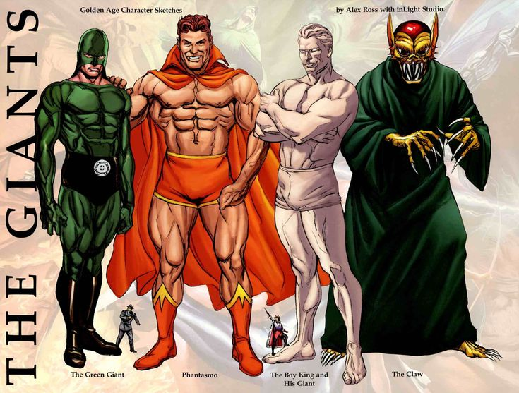
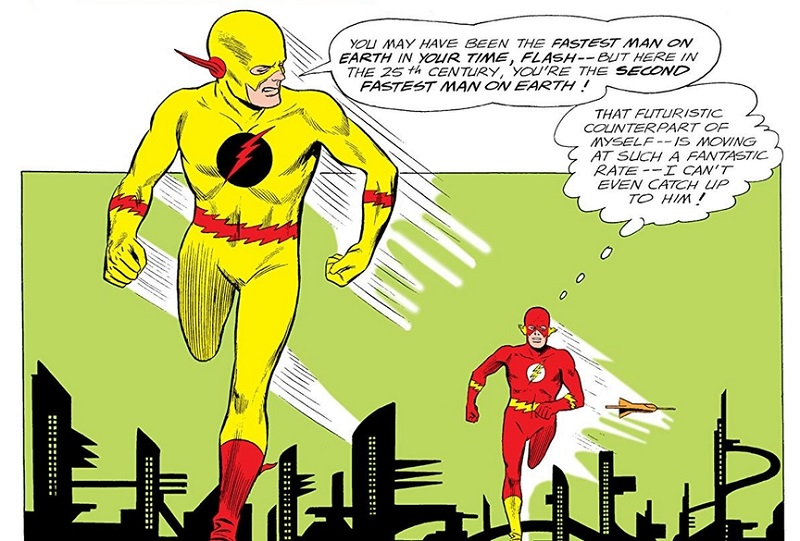

## Entrega 3 - ORM Spring
Nuestra prueba de concepto fue un éxito.
En el transcurrir de los días previos a llevar a cabo las últimas pruebas, nos enteramos que la empresa organizará un gran evento para lanzar la aplicación al mercado, y en los días siguientes, se nos irán dando indicaciones de como prepararnos para atender esta gran inauguración.

Lo primero que sucede es que piso por piso del edificio donde trabajan, varios sastres y modistas toman las medidas de los diferentes empleados. Más extraño aún, al día siguiente, ya cada empleado tiene su propio traje de gala hecho a medida esperandolos en su escritorio.
Luego, se les pide que vayan al evento cubriendo sus rostros con máscaras, antifaces o cascos. Se explicita que su elección debe ser consciente y que deberán elegir una prenda que "represente certeramente a su ego".  Se avisa también que durante la fiesta bajo ninguna medida deberán retirar sus máscaras.
Finalmente, se les exige que sean extremadamente puntuales, y que la dirección solo se les será enviada por mail unas pocas horas antes del evento.

Todo muy inusual, pero uno ya conociendo las excentricidades de las corporaciones multinacionales, no lo piensa mucho y siguen con su jornada.

Llega entonces la noche de gala.

Se les da la dirección de un boliche que conocen, encontrado en un barrio popular a las afueras del conurbano bonaerense.

En la entrada, dos figuras delgadas, pálidas, con una altura poco normal, pelucas fluor con un corte al estilo marta minujin, lentes oscuros y manerismos excéntricos los reciben y dan la bienvenida

" Creadores, pasen por favor, este festejo es para ustedes y para toda la humanidad. Hoy seremos observadores de un antes y un después, preparense."

No tienen mucho tiempo para pensar lo que acaba de suceder cuando son empujados por sus compañeros dentro del boliche de mal augurio.

Por un segundo sus vistas se ven nubladas por una oscuridad de consistencia viscosa, sin entender muy bien qué es lo que está pasando.

Al segundo siguiente, su cuerpo siente un leve mareo  previo a que una brisa primaveral los golpee con olores desconocidos pero dulces y agradables.

Al tercero, ante ustedes observan cómo se extiende un gran valle verde rodeado de montañas, lagos y fauna desconocida.

Dos filas de gente vestida muy elegantemente con trajes, máscaras, antifaces y cascos  les abren el paso hasta una singular figura que convoca a todos los presentes desde una grada.

Y finalmente, detrás de él ven una gran torre de un material muy pulcro y blanco como el marfil extendiéndose hacia los cielos.

Involuntariamente se detienen unos segundos a observar con su mirada la torre.
Tallado en sus paredes, incluso a la gran distancia a la que se encuentra, pueden ver escenas de combates épicos y criaturas míticas.
Dioses, monstruos y humanos enfrentándose en cada gravado, en una lucha sin terminar, cincelada minuciosamente en una torre cuyo fin, y fin a sus gravados les es imposible de determinar.

" Creadores, les agradecemos profundamente por sus contribuciones estos últimos meses" - Los interrumpe el hombre del centro, captando inmediatamente la atención de todos

" A partir de hoy, "EPERs UBER Men" será lanzado a nuestro público superhumano, y con ello, comenzará una nueva era para todos nosotros" - El hombre, se da vuelta para observar la torre, cuya entrada apenas alcanzan a ver.
  En la torre, dos grandes columnas abren paso a un gran pasillo sin ninguna clase de iluminación, un velo impenetrable a sus sentidos detrás del que uno solo puede llegar a imaginarse que se encontrara.
  
" Aun así, no todo está listo aún... y no lo va estar por un tiempo más." Dice el hombre con cierto resentimiento en su voz y volviendo la mirada a ustedes

" El proyecto debe continuar, permítanme presentarles nuestros próximos requerimientos, los volveremos a ver aquí, otra vez, una vez estos requerimientos están resueltos"

Su extraño locutor se da media vuelta para dejar paso a un pequeñísimo hombrecillo que comienza a comentarles en que comenzarán a trabajar entrada en la nueva semana:

## Modelo

### Villanos

 

Así como aquellos superhumanos que utilizan sus poderes para hacer el bien se llaman Heroes, tambien están aquellos que
los utilizan para el mal. A este tipo de super humanos los llamaremos "villanos". Estos tendrán:

- nombre:String
- imagenUrl:String
- conflictosComenzados:List[Conflicto]
- atributos: List[Atributo]
- vida:Int
- poderes: List[Poder] - Un villano deberá comenzar con al menos un poder.

Los villanos seguirán la misma lógica de atributos, vida y poderes que los heroes, pero ademas podran crear conflictos
dependiendo de sus poderes y capacidades.

### Conflictos
Además de los atributos ya conocidos en los conflictos:

- nombre: String
- progresoHaciaSuResolucion: Int
- pruebas: OrderedList[PruebaDeHabilidad]
- poderesFavorables: List[Poder]
- resueltoPor: Heroe

Agregaremos un atributo más para indicar quien comenzo con ese conflicto

- creadoPor: Villano

Los poderesFavorables para resolver el conflicto por el momento serán los mismos poderes que el villano tenga.

### Pruebas De Habilidades creadas por un villano

 

Un conflicto creado por un villano tendrá tantas pruebas de habilidades como poderes tiene ese villano, de tal forma que cada poder
del villano estará siendo utilizado para crear una prueba de habilidad dentro del conflicto.

Recordemos rápidamente los atributos de una prueba de habilidad.

- nombre: String
- atributoDesafiado: Atributo
- dificultad: Int
- cantidadDeExitos: Int
- retalacion: Int

Ya explicaremos más adelante como es seleccionado el nombre de la prueba de habilidad.
Luego, el resto de los atributos dependeran del poder utilizado para crear la prueba de habilidad.

Pongamos como ejemplo el siguiente poder perteneciente al villano "Profesor Zoom":

- nombre: Speed Force
- atributoPotenciado: Destreza
- cantidadPotenciada: 5

Para saber el atributo desafiado en la prueba de habilidad generada por ese poder, deberemos consultar la siguiente leyenda:

"Se necesita una **Inteligencia** superior para vencer a la **Fuerza** bruta de un héroe

Se necesita una **Fuerza** hercúlea para derrotar a un heroe con una **Constitucion** titanica

Se necesita de **Constitucion** colosal para soportar la arremetida de un héroe con **Destreza**

Se necesita de una **Destreza** avasalladora para sobrecargar a un héroe con **Inteligencia** prodigiosa"

De tal modo que, por ejemplo, si un villano utiliza un poder de **Destreza** para crear una prueba de habilidad, esta prueba de habilidad
podrá ser solo superada con **Constitución**.
Si el villano utiliza un poder con **Fuerza** para crear la prueba, la prueba de habilidad se superará con **Inteligencia**.
Y asi.

Volviendo a nuestro ejemplo, el **atributoDesafiado** por la prueba de habilidad generada por la speed force de Zoom, sería **Constitución**.

Aún nos queda determinar **dificultad**, **cantidadDeExitos** y **retaliación**.
Estos comenzarán con 1 punto como base, y luego, utilizando como "puntaje" la **cantidadPotenciada** que tiene el villano en el poder iterado, se repartirán
el resto de los puntos de manera aleatoria.

Cómo Zoom tiene **cantidadPotenciada: 5** en el poder utilizando para generar esta prueba de habilidad, significa que **5 puntos** serán asignados
de forma aleatoria entre la **dificultad**, **cantidadDeExitos** y **retalacion** de la prueba generada.

En nuestro ejemplo, aleatoriamente la prueba de habilidad quedo con los siguientes puntos:

- dificultad: 1 (base)       +2 =3
- cantidadDeExitos: 1 (base) +2 = 3
- retalacion: 1 (base)       +1 = 1

Nótese que los puntos totales -3 (por los puntos base) da 5, que es la **cantidadPotenciada** del poder "Speed Force" de Zoom.

Es importante recordar también que la cantidad dificultad no puede superar los 6 puntos.

Finalmente, recordemos que el villano creará 1 prueba de habilidad por cada poder que tenga, así que profesor zoom deberá realizar esta operación por cada otro poder que tenga.

### Poderes

Además de los atributos que conocemos, se le agregara un nuevo:

- nombresPosiblesDePruebasDehabilidad: List<String>

Que se utilizara para aleatoriamente, seleccionar un nombre que se le dará a las pruebas de habilidad generadas por ese poder.

## Servicios
Se pide que implementen los siguientes servicios los cuales serán consumidos por el frontend de la aplicación.

Primero necesitaremos de un servicio CRUD nuevo para los villanos:

### VillanoService

- crear(villano:Villano):Villano
- actualizar(villano:Villano):Villano
- recuperar(villanoId:Int):Villano
- eliminar(villanoId:Int)
- recuperarTodos():List<Villano>

### ConflictoService
Nos interesara tambien agregar el siguiente mensaje en conflictoService:

- crearConflicto(villanoId:Int,nombre:String):Conflicto  - Que hará uso de los poderes del villano para crear el conflicto con sus pruebas de habilidad.

### RankingService:
Nos interesa recopilar información sobre los mejores héroes y villanos para hacer análisis de datos sobre ello luego, para eso deberemos implementar el siguiente servicio que hará uso de paginación para mostrar los datos más cómodamente en el front.

Para todos los métodos se pedirá una página, y una dirección que puede ser : **ASCENDENTE** o **DESCENDENTE**

- losMasPoderosos(direccion:Direccion, pagina:Int?):List<Heroe> -
Devuelve los héroes con más cantidad de poderes ordenados en la dirección paginados de a 5.

- guardianes(direccion:Direccion, pagina:Int?):List<Heroe> -
Devuelve los héroes que más conflictos resolvieron paginados de a 5.

- hyperVillanos(direccion:Direccion, pagina:Int?):List<Villano> -
Devuelve los villanos que comenzaron más conflictos resueltos por héroes con algún atributo mayor a 10,  paginados de a 5.

Un ejemplo: losMasPoderosos(ASCENDENTE, 0): Devuelve los 5 heroes mas poderosos.

### Integracion a Spring

Además, en para poder hacer uso del front, nos interesara:

- Pasar la transaccionalidad de todos los servicios a Spring
- Que los DAOs implementen la interfaz de Spring 'JpaRepository' en lugar del DAO genérico previsto en el TP anterior.
- Crear controllers REST para todos los servicios implementados hasta ahora y los implementados en este TP también.
- Se implementen los DTO que les daremos, para generar un contrato de comunicación con el front.

## Se pide:

- Que provean implementaciones para las interfaces descriptas anteriormente.
- Asignen propiamente las responsabilidades a todos los objetos intervinientes, discriminando entre servicios, DAOs y objetos de negocio.
- Creen test que prueben todas las funcionalidades pedidas, con casos favorables y desfavorables.
- Que los tests sean deterministicos. Hay mucha lógica que depende del resultado de un valor aleatorio. Se aconseja no utilizar directamente generadores de valores aleatorios (random) sino introducir una interfaz en el medio para la cual puedan proveer una implementación mock determinística en los tests.
- Integren el TP existente (de Hibernate) migrando e integrando a Spring las funcionalidades pedidas.

### Consejos útiles:

- Comiencen con la migracion a Spring antes de encarar los nuevos servicios y requerimiento de modelo
- Finalicen los métodos de los services de uno en uno. Que quiere decir esto? Elijan un service, tomen el método más sencillo que vean en ese service, y encárguense de desarrollar la capa de modelo, de servicios y persistencia solo para ese único método. Una vez finalizado (esto también significa testeado), pasen al próximo método y repitan.
- Para afrontar el rankingService, primero resuelvan las queries y luego introduzcan la paginacion. Un problema a la vez.
