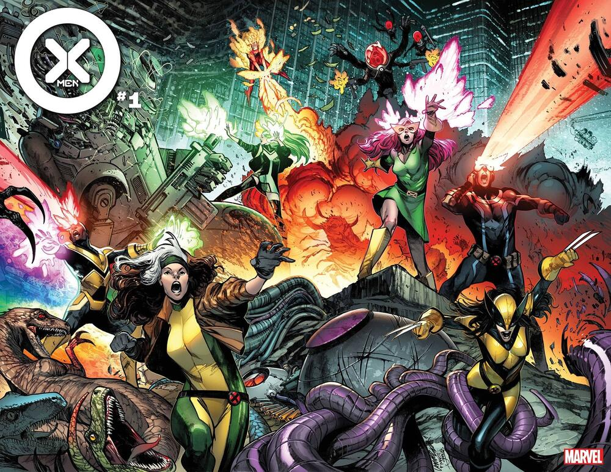
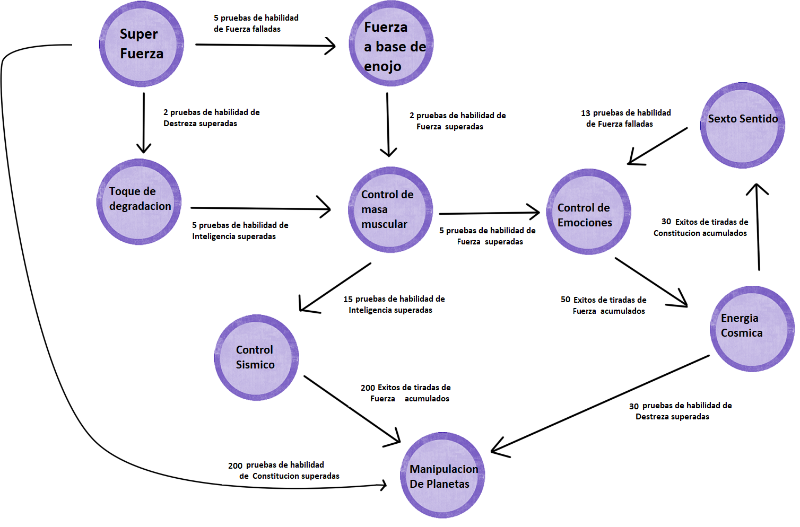

## Entrega 4 - No-SQL - Neo4J

Es un dia como cualquier otro en la oficina tras haber finalizado el requerimiento de agregar villanos, cuando ven como
llega a la oficina el pequeñísimo hombrecillo que nos había comunicado aquella misma tarea unas semanas atrás.

Pueden ver como se dirige con premura a la oficina de su jefe, donde le entrega una carta y sin esperar respuesta se retira dejando la oficina tan rápido como llegó.

Su jefe no tarda mucho en leer el mensaje. Lo lee una, dos, tres veces, y vuelve a comenzar, asegurandose de entender completamente su contenido antes de tomar accion.

Al terminar, se para y se dirige hacia el equipo técnico con un comunicado: Llegaron nuevos requerimientos.

## Mutaciones

  

Así como el cuerpo de un humano común cambia para reflejar el estilo de vida que lleva, los poderes que los héroes poseen sufren de cambios similares.

A estos cambios  los llamaremos "mutaciones".

### Condición de mutación

Una condición de mutación se representará como una relación entre un poder y otro

Después de cada intento de resolución de conflicto, se deberá evaluar si alguno de los poderes del héroe muta. 
Para ello, deberemos analizar bajo qué condición puede ocurrir esa mutación  y si esa condición se cumple luego del intento de resolucion de conflicto.

Ejemplifiquemos:

Luffy tiene el poder de "Hombre de goma" que puede mutar a "Fuerza caricaturesca" si se cumple la siguiente condición:

`15 (cantidad) Pruebas de habilidad (evaluacion) de Fuerza (atributo) superadas (resultado)`

Eso quiere decir que si luego de intentar resolver un conflicto, Luffy cuenta que supero 15 pruebas de habilidad de fuerza en total, su poder de "Hombre de goma" mutara y ahora Luffy tambien poseera "Fuerza caricaturesca".

Aqui ya vemos entonces cuales son las caracteristicas que forman a una condicion de mutacion.

- Cantidad: Cuál es la cantidad hasta la cual debe llegar la condición  para cumplirse la mutación.
- Evaluacion: Que se esta evaluando? Podra ser una prueba de habilidad, o una tirada de dados.
- Atributo: El atributo que se evaluará.
- Resultado: Si la evaluacion fue superada o fallada.

### Ejemplo del grafo 

  

### Casos borde y aclaraciones
- Que un poder de un heroe mute no significa que lo pierda. Siguiendo nuestro ejemplo, Luffy sigue teniendo el poder "Hombre de goma" aunque ahora tambien tenga "Fuerza caricaturesca".

- Si se dan las condiciones para que un poder mute a más de un poder, lo hará.

Ejemplo: Un héroe con "Control de masa muscular" puede cumplir para las condiciones de "control de emociones" y "control sísmico" al mismo tiempo
Luego de intentar resolver un conflicto, si cumple con ambas condiciones, el héroe ahora tendrá los dos poderes.

- Un héroe no puede mutar un poder a otro que ya posee.

- Los poderes sólo mutan una vez por intento de resolución de conflicto. (No puede suceder que un poder "salte" por cumplir condiciones de mutaciones consecutivas en el grafo)

- Las relaciones de mutación deben ser unidireccionales.

## Servicios

Se deberá implementar un nuevo servicio `mutacionService` que implemente los siguientes métodos

- `crearMutacion(idPoder:long, idPoder:long, condicion:Condicion )` - Crea una relación de mutación de un poder a otro con la condición dada
- `poderesQuePuedenMutar(idHeroe: long): Set<Poderes>` - Dado un héroe, retorna la coleccion de poderes que cumplen al menos una de sus condiciones de mutación
- `mutacionesHabilitadas(idHeroe:Long, idPoder:long): Set<Poderes>` - Dado un héroe y un poder, analiza y retorna las mutaciones de ese poder que cumplen con los requerimientos
- `caminoMasRentable(idPoder:long, idPoder: long, atributos:Set<Atributos>): List<Poderes>` - Dado un poder del cual partir, y uno al que se quiera llegar, devuelve el camino de poderes que menos saltos debe dar solo considerando las mutaciones que sean en base a los atributos provistos.

### Se pide:
- El objetivo de esta entrega es implementar los requerimientos utilizando una base de datos orientada a grafos.
- Creen test unitarios para cada unidad de código entregada que prueben todas las funcionalidades pedidas, con casos favorables y desfavorables.
