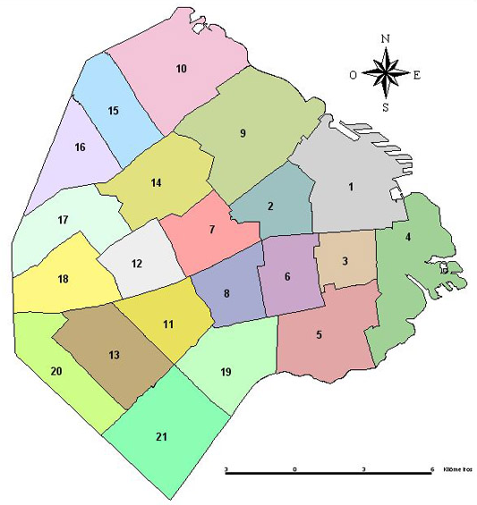

## Entrega 5 - No-SQL - MongoDB

Ya pasaron unos cuantos meses desde aquel lanzamiento tan extraño que tuvo la aplicación.

En sus primeras semanas no se vieron muchos héroes haciendo uso de la app, pero luego de un caso donde un robo mayor fue detenido por un héroe que llegó primero al incidente por estar prestando atención a la aplicación, la base de usuarios explotó.

Todo, absolutamente todo problema mayor y menor comenzó a ser levantado en la app y rápidamente resuelto por un héroe veterano o novato.

Tanta popularidad género, que en las semanas que siguieron, paso de todo: 
- Otras aplicaciones similares surgiendo en el mercado e intentando competir
- Gente común y corriente levantando conflictos inexistentes con tal de llamar la atención de su héroe favorito y poder robarles un segundo de presencia.
- Villanos intentando tirar la aplicación abajo con ataques de DoS o incluso creándose cuentas de mentira para "atender" conflictos que ellos mismos estaban generando y evitar la atención de un héroe real.

Pero aun así y con todo eso, nada parecía poder poner freno a Epers Ubermen.

Ya descansado en el fin de semana, abrís el diario del domingo para leer las noticias: La inseguridad y el crimen en Argentina bajó en un 70% desde que los héroes tercerizan sus servicios a través de la aplicación.
Lanzas una corta carcajada, sabes también que la empresa ya está haciendo planes para extender sus servicios fuera del país: Primero a Latinoamérica, después al resto del mundo.

Y te preguntas entonces: 

¿Qué pasará una vez ya esté extendida la red de héroes por todo el mundo? ¿Acaso se terminará con el crimen? ¿Con la injusticia?

¿Acaso la aplicación podrá terminar con la corrupción humana?

¿Qué será de los héroes una vez ya no haya conflictos para resolver? 

¿Será necesario que sigan existiendo?

¿Un héroe puede ser tal en un mundo sin villanos, sin crimen, sin conflictos?

Te viene a la mente entonces la imagen de la torre blanca que viste aquel extraño día del lanzamiento de la aplicación muchos meses atrás.
Y ahora entendes, eso que habías visto no era una torre, era una nave.

Ellos ya sabían que Epers Ubermen acabaría con el crimen. Ellos ya sabían que los héroes no serían más necesarios en la tierra después de Epers Ubermen.
Ellos ya estaban pensando en el siguiente paso: Las estrellas, la galaxia. 
Por supuesto, en un mundo en el cual todos los super humanos no tienen que ser héroes, estos podrían utilizar esos poderes para el avance de la humanidad.
Un objetivo con el cual la humanidad soñó desde el primer momento que levantó la cabeza hacia los cielos, pero nunca tuvo la fuerza para afrontar: La colonización intergaláctica.

Miras fuera de la ventana, bebes un sorbo de tu té y te tomas unos minutos para admirar la vasta inmensidad de la galaxia.
Nos espera un futuro brillante, y todo es gracias a Epers Ubermen.

## Distritos

  

Un distrito está delimitado por varias coordenadas, los cuales, le dan su forma. 
Además, tiene un nombre.

## Coordenadas

Una coordenada es un par de números (latitud y longitud), que representan un punto en un plano.

### Cambios en el modelo

Hay que agregar una coordenada al **Conflicto** y al **Personaje**(_Heroe/Villano_).

Los conflictos generados por villanos, tienen la coordenada actual del villano

Los Personajes pueden cambiar de coordenadas

**Modificar el obtenerConflictoAleatorio** para que reciba un Heroe y debería devolver
solamente los conflictos que se encuentren en un radio 1 kilometro al heroe.

  

En este ejemplo, podemos ver que el heroe es el que está en el medio del radio de 1 kilometro.
Y el _obtenerConflictoAleatorio_ debería devolver solamente uno de los 5 conflictos (no resueltos)
que están en el radio.

### Distrito mas picante
Con toda esta información, los jefes quieren saber cuál es el distrito más picante, es decir, 
el distrito con más conflictos sin resolver.

Para saber cuál es ese distrito, hay que contar todos los conflictos que estén dentro de su área.

  

En este ejemplo, podemos ver que el distrito con más conflictos es el **9**.

## Servicios

Se deberá modificar el servicio `EnfrentamientoService` 

- `obtenerConflictoAleatorio(idHeroe:Long):Conflicto` - Deberá devolver solamente los conflictos no resueltos que se encuentren en un radio 1 kilometro al heroe.

### DistritoService:

- `crear(distrito:Distrito):Distrito` - Deberá crear un distrito
- `masPicante():Distrito` - Deberá devolver el distrito que tenga más conflictos sin resolver
- `masVigilado():Distrito` - Deberá devolver el distrito tenga mas heroes 

### Consideraciones

- Persistir las coordenadas de los conflictos y de los personajes en Mongo
- Persistir el distrito con su lista de coordenadas en Mongo

### Se pide:
- El objetivo de esta entrega es implementar los requerimientos utilizando una base de datos de documentos.
- Creen test unitarios para cada unidad de código entregada que prueben todas las funcionalidades pedidas, con casos favorables y desfavorables.
